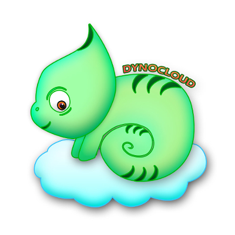

# DynoCloud

## DynoCloud: Exotic Pet Habitat Monitoring and Control System

DynoCloud is and interdisciplinary team composed of six computer and electrical engineers; working together to create an IoT solution capable of monitoring and controlling the climate of an exotic pet enclosure, remotely through the internet.